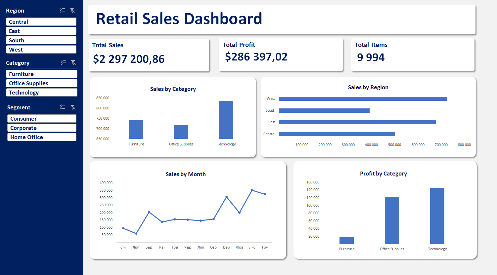
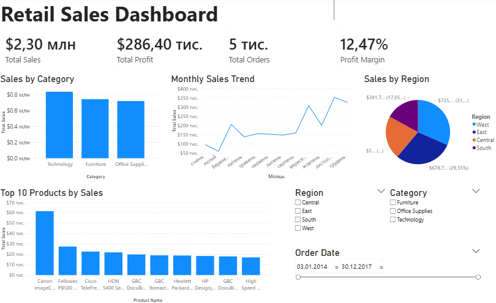
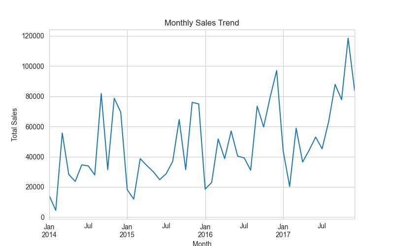

# Retail Data Analytics Portfolio

This repository contains a complete retail data analysis project using Excel, SQL, Power BI and Python based on the Sample Superstore dataset.

The objective of this portfolio is to demonstrate end-to-end data analysis: data cleaning, transformation, analysis and visualization.

---

## Tools and Technologies

- Excel (Power Query, Dashboards, VLOOKUP)
- SQL (data analysis, aggregations, filtering)
- Power BI (interactive dashboards and visualization)
- Python (Pandas, Matplotlib)

---

## Project Structure

### Excel Data Cleaning
- Cleaned and transformed raw sales data using Power Query
- Standardized data formats
- Used VLOOKUP to merge and enrich datasets

### Excel Sales Dashboard
- Built an interactive dashboard in Excel
- Created key metrics: Sales, Profit, Orders
- Analyzed performance by category and region

### SQL Sales Analysis
- Performed analysis using SQL queries
- Used GROUP BY, aggregations and filtering

### Power BI Dashboard
- Built an interactive dashboard
- Visualized sales, profit and regional performance

### Python Exploratory Data Analysis
- Performed data analysis using Pandas
- Visualized data using Matplotlib
- Identified trends and patterns

---

## Dataset

Sample Superstore dataset

---

## Summary

This portfolio demonstrates the ability to:
- clean and transform data
- analyze business performance
- work with multiple tools
- build dashboards and present insights
